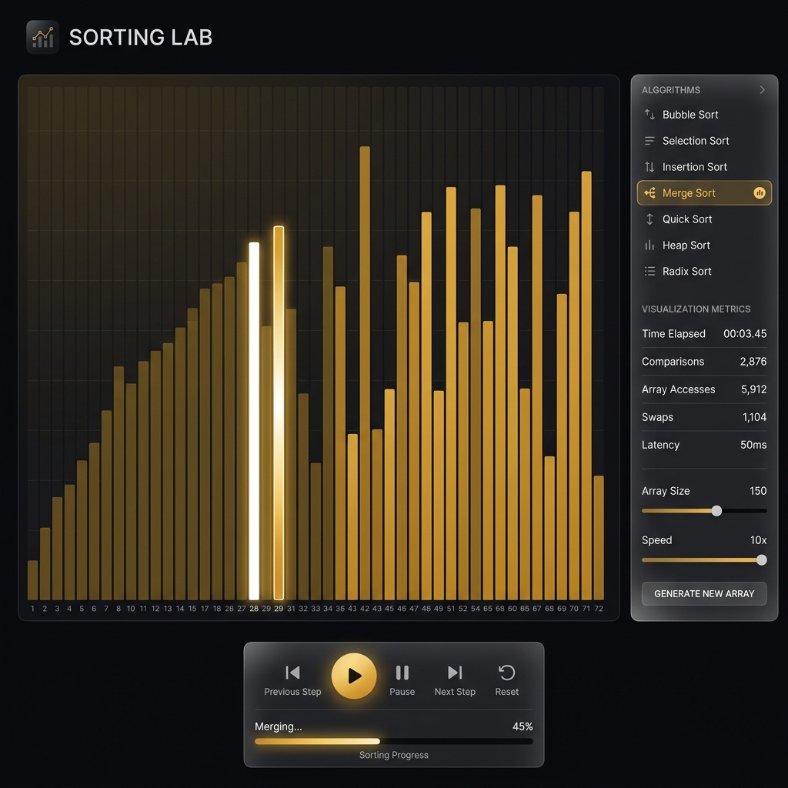
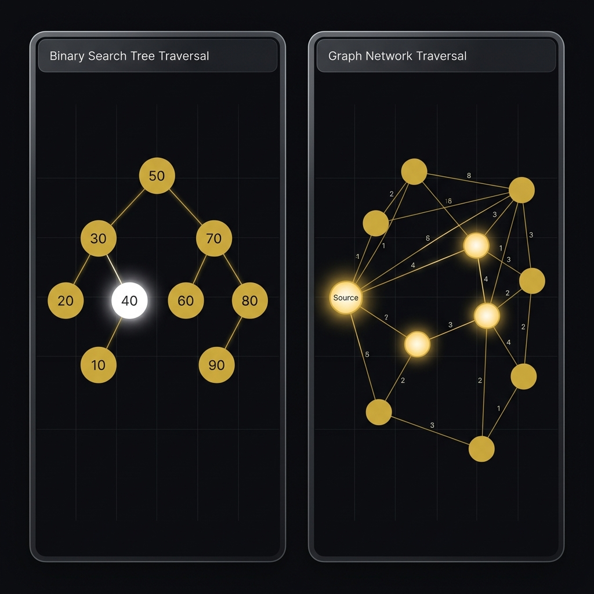

<](https://react.dev)
[](https://www.typescriptlang.org)
[](https://vitejs.dev)
[](https://threejs.org)
[](https://tailwindcss.com)
[](LICENSE)

**Experience the next generation of algorithm and data structure visualization.**  
**Seamless. Interactive. Impossibly smooth.**

[Live Demo →](https://algoverse.vercel.app) · [Report Bug](https://github.com/Divyakush2006/AlgoVerse/issues) · [Request Feature](https://github.com/Divyakush2006/AlgoVerse/issues)

<br />



</div>

<br />

---

<br />

## 📋 Table of Contents

- [Overview](#-overview)
- [Key Features](#-key-features)
- [Architecture](#-architecture)
- [Tech Stack](#-tech-stack)
- [Module Breakdown](#-module-breakdown)
- [Getting Started](#-getting-started)
- [Project Structure](#-project-structure)
- [Design System](#-design-system)
- [Performance](#-performance)
- [Roadmap](#-roadmap)
- [Contributing](#-contributing)
- [License](#-license)

<br />

## 🔭 Overview

**AlgoVerse** is a high-fidelity, interactive visualization platform for data structures and algorithms. It transforms abstract computational concepts into tangible, real-time visual experiences — enabling users to truly *see* how algorithms behave across different inputs, edge cases, and complexity classes.

Built with a premium design language featuring glassmorphism aesthetics, 3D WebGL hero scenes, and buttery-smooth 60fps animations, AlgoVerse brings production-grade engineering to educational tooling.

> **12 interactive modules** · **8 sorting algorithms** · **7+ data structures** · **3 graph algorithms** · **60fps animations** · **Fully client-side**

<br />

## ✨ Key Features

<table>
<tr>
<td width="50%">

### 🔬 Sorting Laboratory
Step-through visualization for **6 sorting algorithms** with real-time telemetry tracking comparisons, swaps, and execution progress. Supports custom datasets, adjustable speed (0.25x–4x), and array sizes up to 200 elements.

### ⚔️ Comparison Arena
Side-by-side algorithm **race mode** — pit any two sorting algorithms against the same dataset and watch them compete in real time with live metrics and winner declaration.

### 📊 Complexity Lab
Interactive **SVG growth-curve charting** plotted from computed data points. Toggle between Best/Average/Worst case, Time/Space complexity, and dynamically adjust input size (n) up to 1000.

</td>
<td width="50%">

### 🌳 Tree Explorer
Canvas-rendered **BST, AVL, Min-Heap, and Max-Heap** visualization with animated insertions, automatic AVL rotations (LL, RR, LR, RL), and step-by-step traversals (inorder, preorder, postorder).

### 🔗 Graph Visualizer
Click-to-place **interactive node graph** with weighted edges, supporting **BFS**, **DFS**, and **Dijkstra's shortest path** with animated traversal highlighting.

### 🧠 Algorithm Recommender
Constraint-based **neural advisory engine** — input system parameters (memory, latency, data volume) and receive optimal algorithm recommendations with architectural rationale.

</td>
</tr>
</table>

<br />

<div align="center">

</div>

<br />

## 🏗 Architecture

```
┌──────────────────────────────────────────────────────────────────────┐
│                         AlgoVerse Frontend                         │
├──────────────────────────────────────────────────────────────────────┤
│                                                                      │
│   ┌─────────────┐    ┌──────────────────┐    ┌──────────────────┐   │
│   │   App Shell  │    │   Page Router    │    │    Sidebar Nav   │   │
│   │  (App.tsx)   │───▶│  (State-based)   │───▶│  (3 sections)   │   │
│   └─────────────┘    └──────────────────┘    └──────────────────┘   │
│                              │                                       │
│          ┌───────────────────┼───────────────────┐                   │
│          │                   │                   │                   │
│   ┌──────▼──────┐     ┌──────▼──────┐     ┌──────▼──────┐          │
│   │  CORE LABS  │     │  STRUCTURES │     │    TOOLS    │          │
│   │             │     │             │     │             │          │
│   │ SortingLab  │     │ TreeExplorer│     │ Recommender │          │
│   │ Comparison  │     │ LinearStruct│     │ ProvingGrnd │          │
│   │ Complexity  │     │ Graphs      │     │ AlgoDeck    │          │
│   │ Dashboard   │     │ HashMaps    │     │ Settings    │          │
│   └─────────────┘     └─────────────┘     └─────────────┘          │
│          │                   │                   │                   │
│   ┌──────▼───────────────────▼───────────────────▼──────┐           │
│   │              Engine Layer (sortingEngine.ts)          │           │
│   │  Step-generator functions producing SortStep arrays  │           │
│   └──────────────────────────────────────────────────────┘           │
│                              │                                       │
│   ┌──────────────────────────▼──────────────────────────┐           │
│   │                    Rendering Layer                    │           │
│   │     Canvas 2D  ·  SVG Charts  ·  WebGL (Three.js)   │           │
│   │          Framer Motion  ·  CSS Animations            │           │
│   └──────────────────────────────────────────────────────┘           │
│                                                                      │
└──────────────────────────────────────────────────────────────────────┘
```

<br />

## 🛠 Tech Stack

| Layer | Technology | Purpose |
|:------|:-----------|:--------|
| **Framework** | React 19 | Component architecture with hooks-based state management |
| **Language** | TypeScript 5.8 | Type safety and enhanced developer experience |
| **Build Tool** | Vite 6.2 | Lightning-fast HMR and optimized production builds |
| **3D Rendering** | Three.js + React Three Fiber | WebGL-powered 3D hero scene with glass-transmission materials |
| **Animation** | Framer Motion (motion/react) | Layout animations, page transitions, and micro-interactions |
| **Styling** | Tailwind CSS 4.1 | Utility-first styling with custom design tokens |
| **Icons** | Lucide React | 500+ consistent, tree-shakeable SVG icons |
| **Canvas** | HTML5 Canvas API | Tree and graph node rendering with real-time updates |
| **Charts** | Custom SVG | Hand-crafted complexity growth curve visualizations |

<br />

## 📦 Module Breakdown

### Core Laboratories

| Module | Description | Algorithms / Features |
|:-------|:------------|:---------------------|
| **Sorting Lab** | Interactive step-by-step sorting visualization with bar-chart rendering | Bubble, Selection, Insertion, Merge, Quick, Heap Sort |
| **Comparison Arena** | Side-by-side algorithm benchmarking with synchronized playback | Any 2 algorithms, real-time CMP/SWP metrics, winner analysis |
| **Complexity Lab** | Interactive Big-O growth curve plotter with SVG rendering | O(1) → O(2ⁿ), Best/Avg/Worst case, Time & Space analysis |
| **Algorithm Deck** | Comprehensive reference encyclopedia with expandable cards | Pseudocode, step-by-step logic, stability/in-place/adaptive badges |

### Data Structures

| Module | Description | Structures |
|:-------|:------------|:-----------|
| **Tree Explorer** | Canvas-rendered tree visualization with animated operations | BST, AVL (auto-balancing), Min Heap, Max Heap |
| **Linear Structures** | Memory-address simulation with LIFO/FIFO visualizations | Linked List, Stack, Queue |
| **Graphs** | Click-to-place interactive graph builder with pathfinding | BFS, DFS, Dijkstra's Shortest Path |
| **Hash Maps** | Collision strategy visualization with live hashing | Separate Chaining, Linear Probing |

### Tools & Intelligence

| Module | Description | Capabilities |
|:-------|:------------|:-------------|
| **Recommender** | Constraint-aware algorithm advisory engine | 6 preset scenarios + custom constraint analysis |
| **Proving Grounds** | Challenge-based testing arena with XP and ranking system | 6 challenges, 4 difficulty tiers, real-time test validation |
| **Settings** | Global configuration panel | Theme, animation speed, accessibility options |

<br />

## 🚀 Getting Started

### Prerequisites

- **Node.js** ≥ 18.x
- **npm** ≥ 9.x (or pnpm/yarn)

### Installation

```bash
# Clone the repository
git clone https://github.com/Divyakush2006/AlgoVerse.git
cd AlgoVerse

# Navigate to the frontend
cd frontend

# Install dependencies
npm install

# Start the development server
npm run dev
```

The app will launch at **`http://localhost:3000`** with hot-module replacement enabled.

### Available Scripts

| Command | Description |
|:--------|:------------|
| `npm run dev` | Start development server on port 3000 |
| `npm run build` | Generate optimized production build |
| `npm run preview` | Preview production build locally |
| `npm run lint` | Run TypeScript type-checking |
| `npm run clean` | Remove the `dist/` output directory |

<br />

## 📁 Project Structure

```
AlgoVerse/
├── frontend/
│   ├── public/
│   │   └── logo.webp                  # Application logo
│   ├── src/
│   │   ├── components/
│   │   │   ├── HeroCanvas.tsx          # 3D WebGL luminous ribbon scene
│   │   │   ├── Sidebar.tsx             # Collapsible navigation sidebar
│   │   │   ├── Navbar.tsx              # Top navigation bar
│   │   │   └── RealityGenerator.tsx    # Modal for data structure initialization
│   │   ├── engine/
│   │   │   └── sortingEngine.ts        # Step-generator for 6 sorting algorithms
│   │   ├── pages/
│   │   │   ├── Dashboard.tsx           # Landing page with 3D hero & module grid
│   │   │   ├── SortingLab.tsx          # Interactive sorting visualizer
│   │   │   ├── ComparisonArena.tsx     # Side-by-side algorithm racing
│   │   │   ├── ComplexityLab.tsx       # Big-O growth curve plotter
│   │   │   ├── TreeExplorer.tsx        # BST / AVL / Heap visualizer
│   │   │   ├── LinearStructures.tsx    # Stack, Queue, Linked List
│   │   │   ├── Graphs.tsx             # Graph builder with BFS/DFS/Dijkstra
│   │   │   ├── HashMaps.tsx           # Hash table collision visualization
│   │   │   ├── Deck.tsx              # Algorithm reference encyclopedia
│   │   │   ├── Recommender.tsx        # AI-styled algorithm advisor
│   │   │   ├── ProvingGrounds.tsx     # Challenge & XP testing arena
│   │   │   └── Settings.tsx           # Application configuration
│   │   ├── constants.ts               # Navigation config & algorithm data
│   │   ├── index.css                  # Design system tokens & base styles
│   │   ├── App.tsx                    # Root component with page routing
│   │   └── main.tsx                   # Application entry point
│   ├── index.html                     # HTML template with SEO meta tags
│   ├── vite.config.ts                 # Vite build configuration
│   ├── tsconfig.json                  # TypeScript compiler options
│   └── package.json                   # Dependencies and scripts
├── .github/
│   └── assets/                        # README images and banners
├── .gitignore
└── README.md
```

<br />

## 🎨 Design System

AlgoVerse employs a bespoke **dark-gold design language** built on custom CSS design tokens:

### Color Palette

| Token | Hex | Usage |
|:------|:----|:------|
| `bg-primary` | `#0A0A0B` | Base background |
| `bg-canvas` | `#050505` | Visualization canvases |
| `accent-primary` | `#D4AF37` | Metallic Gold — primary interactive elements |
| `accent-secondary` | `#996515` | Golden Brown — secondary accents |
| `accent-tertiary` | `#C0C0C0` | Silver — contrast elements |
| `viz-comparing` | `#D4AF37` | Active comparison highlight |
| `viz-sorted` | `#996515` | Sorted element indicator |

### Typography

| Font | Weight | Usage |
|:-----|:-------|:------|
| **Outfit** | 300–900 | Headings and display text |
| **Plus Jakarta Sans** | 400–800 | Body text and UI elements |
| **Syne** | 700–800 | Brand logotype |
| **JetBrains Mono** | 400–700 | Code, metrics, and monospace data |

### Component Primitives

- **`glass-card`** — Frosted glass panels with `backdrop-blur-2xl` and subtle borders
- **`btn-primary`** — Gold gradient buttons with glow shadow and hover lift
- **`btn-ghost`** — Outlined buttons with gold accent and blur backdrop
- **`input-field`** — Dark-themed inputs with focus-state border transitions

<br />

## ⚡ Performance

| Metric | Target | Implementation |
|:-------|:-------|:--------------|
| **Render FPS** | 60fps | Hardware-accelerated CSS transforms + `requestAnimationFrame` |
| **Bundle Size** | Optimized | Vite tree-shaking + code splitting per module |
| **3D Scene** | Adaptive | `dpr={[1, 2]}` responsive pixel ratio, baked shadows |
| **Animations** | Jank-free | Framer Motion `layout` animations with GPU compositing |
| **State** | Zero-latency | React hooks with local state — no external state library overhead |
| **Canvas Rendering** | Real-time | Direct Canvas 2D API for tree/graph rendering at native speed |

<br />

## 🗺 Roadmap

- [x] Sorting algorithm visualization (6 algorithms)
- [x] Side-by-side comparison arena
- [x] Big-O complexity growth curves
- [x] Tree structures (BST, AVL, Min/Max Heap)
- [x] Linear structures (Stack, Queue, Linked List)
- [x] Graph algorithms (BFS, DFS, Dijkstra)
- [x] Hash map collision strategies
- [x] Algorithm reference deck with pseudocode
- [x] Constraint-based algorithm recommender
- [x] Challenge-based proving grounds with XP system
- [ ] Dynamic Programming visualization module
- [ ] String algorithm visualizations (KMP, Rabin-Karp)
- [ ] User progress persistence with local storage
- [ ] Dark/Light theme toggle
- [ ] Mobile-responsive layouts
- [ ] Export visualizations as GIF/video

<br />

## 🤝 Contributing

Contributions are welcome! Here's how to get involved:

1. **Fork** the repository
2. **Create** a feature branch (`git checkout -b feature/amazing-feature`)
3. **Commit** your changes (`git commit -m 'feat: add amazing feature'`)
4. **Push** to the branch (`git push origin feature/amazing-feature`)
5. **Open** a Pull Request

Please ensure your code follows the existing style conventions and includes appropriate TypeScript types.

<br />

## 📄 License

This project is licensed under the **MIT License** — see the [LICENSE](LICENSE) file for details.

<br />

---

<div align="center">

<br />

**Built with precision. Engineered for performance.**

<br />

<sub>Designed & developed with ❤️ by <a href="https://github.com/Divyakush2006">Divyakush2006</a></sub>

<br />
<br />

<a href="https://github.com/Divyakush2006/AlgoVerse/stargazers">
  
</a>
<a href="https://github.com/Divyakush2006/AlgoVerse/network/members">
  
</a>
<a href="https://github.com/Divyakush2006/AlgoVerse/issues">
  
</a>

</div>
]]>
